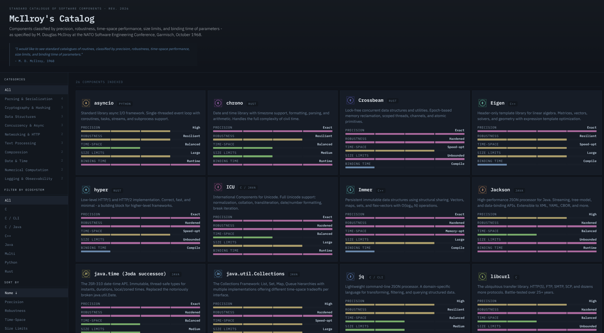

# McIlroy's Catalog

Doug McIlroy's catalog, a software component catalog focused on technical specifications and metrics of modern software.
Today, it would be called something like 'a no-bullshit software component package registry'.



## Quick Start

```bash
# Install dependencies
npm install

# Run development server
npm run dev

# Build for production
npm run build

# Preview production build
npm run preview
```

After building, the `dist/` folder contains static files that can be hosted anywhere - no server-side logic needed.

## What is this

Here's McIlroy's catalog, realized.
The design choices were deliberate - an industrial technical catalog aesthetic, like a microfiche of engineering specifications, because that's what he was asking for. Not an app store with flashy buttons and whistles, but a parts catalog.
A parts catalog the way machinists and electrical engineers have had them since the 19th century.

The 22 components are classified across his five dimensions:

- precision
- robustness
- time-space performance
- size limits
- binding time

I chose components that represent genuinely interchangeable options within their categories such as the Text Processing section with Rust's regex, Google's RE2, and ICU.
These offer different tradeoffs on exactly the axes McIlroy specified (RE2 and Rust regex trade expressiveness for guaranteed O(n) robustness, while ICU trades size for Unicode precision).

The "Comparable Components" and "Portability & Transliteration" sections directly address his requirement that you should be able to "apply routines in the catalogue to any of a large class of often quite different machines", mapping each component to its equivalents across ecosystems.

---

If you still have no clue what this is all about, read Brian Randells paper "Software Engineering: As it was in 1968":

> Randell, Brian. (1979). Software Engineering: As it was in 1968.. 1-10. The paper attempts to portray, the 1968 software scene, by recalling the principle technical issues and concerns of the time. These are discussed under the headings Software as a Commodity, Programming Languages, Multi-programming and Time-Sharing, Modularity and Structuring, and The Problems of Large Systems. The paper ends with an account of the major debates at the first conference ever held on the subject of "software engineering", the NATO Conference that took place in Garmisch in October 1968.

[ResearchGate](https://www.researchgate.net/publication/221555451_Software_Engineering_As_it_was_in_1968)

[doi/10.5555/800091.802915](https://dl.acm.org/doi/10.5555/800091.802915)
